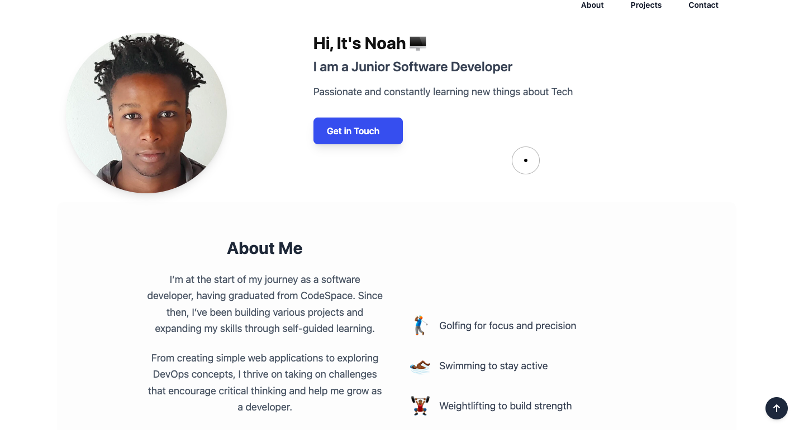

# 🖥️ My Developer Portfolio

 

Welcome to the repository for my personal developer portfolio.  
This site is the **hub** for my work — showcasing my best projects, skills, and the journey I’ve been on as a software developer.

---

## 🚀 Live Demo
**[Visit my portfolio here](https://portfolio-8xil0llvy-noahsparkes-projects.vercel.app/)**

---

## 📜 About
I built this portfolio to create a **central space** where potential employers, collaborators, and curious developers can easily explore what I do.  
The site is fully responsive, optimized for performance, and designed to give a clear impression of my skills.

**Key features:**
- Fully responsive design for mobile, tablet, and desktop
- Smooth animations and transitions
- Links to all major projects with detailed descriptions
- Contact form integration

---

## 🛠️ Tech Stack
- **Frontend:** React, Javascript
- **Styling:** Tailwind CSS
- **Hosting:** Vercel 
- **Other:** Framer Motion (for animations), Web3forms (contact form)

---

## 📦 Installation & Setup
If you want to run this locally:

-```bash
# Clone the repository
git clone https://github.com/Noahsparkes/Portfolio

# Navigate into the project folder
cd your-portfolio

# Install dependencies
npm install

# Start the development server
npm run dev


## 📬 Contact

You can reach me through any of the following:

- **Email:** [noah.sparkes19@gmail.com]
- **LinkedIn:** [https://www.linkedin.com/in/noah-sparkes-22a4ba267/]
- **GitHub:** [https://github.com/Noahsparkes]

